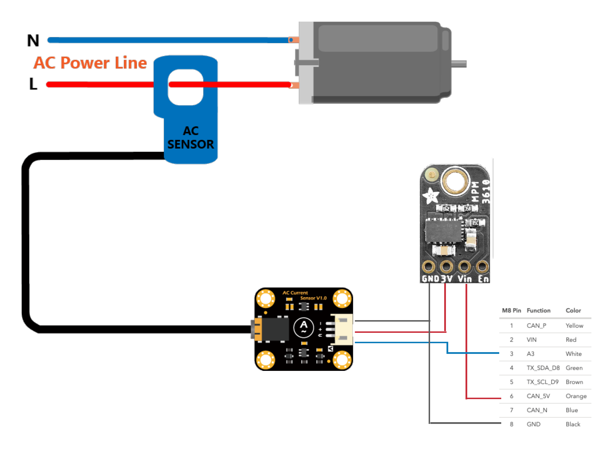

# blueprint-tracker-energy-monitoring

This tutorial shows how to measure AC current using the Tracker One and a few external components. 

## Hardware

This Solutions Accelerator uses:
* Tracker One
* M8 cable
* 5V to 3.3V converter (https://www.adafruit.com/product/4683)
* Analog AC current sensor (https://www.dfrobot.com/product-1486.html)



The current sensor boards converts the output of the sensor probe into an analog output. That output is connected to pin 3 of the M8 connector, which is analog input A3 for the Tracker One.

The other two pins are power and ground, which are connected to the DC/DC converter. The DC/DC is necessary since the output power of the Tracker One is 5V, and the input pins for sensing are 3.3V.

## Software

The code to translate the analog input into current is found in `main.cpp`.

First, a callback is defined that is called when the Tracker One will publish a location point. This callback reads the value and uses the formula from the manufacturer (https://wiki.dfrobot.com/Gravity_Analog_AC_Current_Sensor__SKU_SEN0211_#target_3) to arrive at the current. It then inserts it into the location point JSON.

```c++
void loc_gen_cb(JSONWriter &writer, LocationPoint &point, const void *context)
{
    writer.name("current").value(readACCurrentValue());
}
```

The callback is registered with the Tracker Edge software in `setup()`:

```c++
 Tracker::instance().location.regLocGenCallback(loc_gen_cb);
```

Once running, the Tracker One will publish the current measured and it will be associated with the location of the device. The current will be displayed on the Particle console map for each Tracker device running this firmware.

### Getting the Tracker Edge firmware

A complete project based on Tracker Edge v19 is available in the `firmware` directory in this repository.
